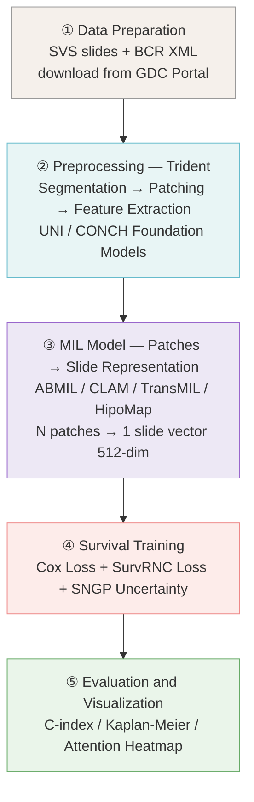

# Uncertainty-Aware Histopathology Survival Analysis

## Pipeline

## Datasets
- The Cancer Genome Atlas Program (TCGA) Lung Adenocarcinoma (LUAD)
    - Data Source: [National Cancer Institute GDC Data Portal](https://portal.gdc.cancer.gov/)
    - Manifest: [gdc_manifest_full_luad_dx.txt](manifests/gdc_manifest_full_luad_dx.txt)
    - Result: 478 cases, 541 files (some cases have multiple diagnostic slides)

    | Filter                | Value            |
    |------------------------|------------------|
    | Program               | TCGA             |
    | Project               | TCGA-LUAD        |
    | Access                | Open             |
    | Data Format           | svs              |
    | Data Type             | Slide Image      |
    | Experimental Strategy | Diagnostic Slide |

## Contributors
| Name                 | University                             |
|----------------------| -------------------------------------- |
| Robert Pearce        | University of Nevada, Las Vegas        |
| Sejun Park           | Gyeonggi Science Technology University |
| Hailey (Heejae Kwon) | Sookmyung Womens University           |
| HyeonKyeong Lee      | Gyeongsang National University         |

## Acknowledgments
This project was completed during the International Machine Learning Camp hosted by the [University of Nevada, Las Vegas](https://www.unlv.edu/cs). Resources and guidance were provided by [Dr. Mingon Kang](https://kang.dataxlab.org/index.php).
